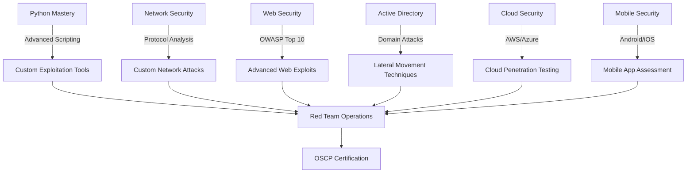

#  Welcome to My Cybersecurity & Python Arsenal

[](https://www.python.org/)
[](https://github.com/topics/cybersecurity)
[](https://github.com/topics/ethical-hacking)
[](https://github.com/topics/red-team)
[](https://github.com/topics/ctf)

<p align="center">
  
</p>

## 🕵️‍♂️ About Me

```python
#!/usr/bin/env python3

class EthicalHacker:
    def __init__(self):
        self.name = "mitkow7"
        self.role = "Student"
        self.language_spoken = ["en_US", "Python", "Bash", "PowerShell"]
        self.specializations = [
            "Penetration Testing", 
            "Exploit Development",
            "Social Engineering",
            "Red Team Operations"
        ]
    
    def say_hi(self):
        print("Thanks for dropping by! Hope you find my work interesting.")

me = EthicalHacker()
me.say_hi()
```

I'm an aspiring cybersecurity professional with a focus on offensive security, ethical hacking, and red team operations. My repositories document my journey into the depths of cybersecurity - from crafting Python tools to breaching vulnerable systems (ethically, of course).

## 🛠️ Weapons of Choice

```
╔══════════════════════════════════════════════════════════════╗
║ OFFENSIVE SECURITY TOOLKIT                                   ║
╠═══════════════════╦══════════════════╦═══════════════════════╣
║ ◉ Python          ║ ◉ Metasploit     ║ ◉ Wireshark           ║
║ ◉ Kali Linux      ║ ◉ Burp Suite     ║ ◉ Ghidra              ║
║ ◉ NMAP            ║ ◉ Impacket       ║ ◉ BloodHound          ║
║ ◉ GoBuster        ║ ◉ Hashcat        ║ ◉ SQLmap              ║
╚═══════════════════╩══════════════════╩═══════════════════════╝
```

## 📊 GitHub Stats & Activity

<p align="center">
  
  
</p>

<p align="center">
  
</p>

## 🔥 Featured Projects

### 🔒 [Keylogger](https://github.com/mitkow7/keylogger)
 

A Python-based keylogger demonstrating endpoint surveillance capabilities:
- Keystroke monitoring with minimal CPU footprint
- Encrypted data exfiltration via email or custom server (In progress)
- Process masking to avoid detection in task manager (In progress)

### ☔ [Umbrella-Reminder](https://github.com/mitkow7/umbrella-reminder)
 

Weather monitoring application showcasing API integration:
- Weather API integration with secure authentication
- Location data handling with geolocation APIs
- Scheduled task implementation for regular checks

### 💹 [Financial-Data-Retrieval-System](https://github.com/mitkow7/financial-data-retrieval-system)
  

Financial data tool with security-focused design:
- Secure API authentication with rate limiting protection
- End-to-end encryption for sensitive financial data
- SQL injection prevention with parameterized queries
- Certificate pinning for API connections

### 🎮 [Tic-Tac-Toe](https://github.com/mitkow7/tic-tac-toe)
 

## 🧪 CTF Achievements

<p align="center">
  
  
  
</p>

## 🦠 Vulnerable Machine Conquests

```
📦 TryHackMe         🔓 40 Rooms Completed  
📦 VulnHub           🔓 15 VMs Rooted
📦 OffSec Proving    🔓 12 Machines Pwned
```

## 🚀 Current Learning Path



## 🧰 Daily Workspace

```
💻 Main: Kali Linux (VM) + Mac Host
🖥️ Attack Lab: Proxmox with various vulnerable VMs
☁️ Cloud: AWS instances for testing and deployment
📚 Learning: TryHackMe VIP
```

## 📚 Security Reading List

| Category | Recommended Books |
|----------|------------------|
| **Red Teaming** | Red Team Field Manual, The Hacker Playbook 3 |
| **Exploitation** | The Shellcoder's Handbook, Black Hat Python |
| **Web Security** | The Web Application Hacker's Handbook, OWASP Testing Guide |
| **Social Engineering** | Social Engineering: The Art of Human Hacking |
| **Malware Analysis** | Practical Malware Analysis, The Art of Memory Forensics |

## 🔗 Connect & Hack Together

[](https://linkedin.com/in/martin-mitkov)

## 📅 Weekly Security Routine

- **Monday**: Active Directory attacks practice
- **Tuesday**: Web application security testing
- **Wednesday**: Python tool development
- **Thursday**: CTF challenges or HackTheBox machines
- **Friday**: Network protocol analysis
- **Weekend**: Security research & reading

---

<p align="center">
  
</p>

<p align="center">
  Visitor count<br>
  
</p>

*"The quieter you become, the more you can hear."* - Kali Linux
